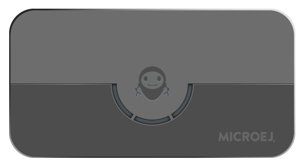

# <VEE_PORT> for <BOARD_MANUFACTURER> <BOARD_NAME>

This project is used to build a <VEE_PORT> for the <BOARD_NAME>
development board.



Clone the repository with `git clone --recursive <Git repository URL>`.

## Related Files

This directory also contains:

* [CHANGELOG](./CHANGELOG.md) to track the changes in the <VEE_PORT> for <BOARD_NAME> 
* [RELEASE NOTES](./RELEASE_NOTES.md) to list:

  - the supported hardware,
  - the known issues and the limitations,
  - the development environment,
  - the list of the dependencies and their versions.

* [README BSP](./README_BSP.md) recommended for users familiar with the
  <BOARD_MANUFACTURER> SDK/BSP and advanced usage on how to customize the build
  process.

## Board Technical Specifications

| Property                | Value                           |
| ----------------------- |---------------------------------|
| Name                    | <BOARD_NAME>                    |
| Revision                | <BOARD_REVISION>                |
| MCU part number         | <Board MCU part number>         |
| MCU revision            | <Board MCU revision>            |
| MCU architecture        | <Board MCU architecture>        |
| MCU max clock frequency | <Board MCU max clock frequency> |
| Internal flash size     | <Board Internal flash size>     |
| Internal RAM size       | <Board Internal RAM size>       |
| External flash size     | <Board External flash size>     |
| External RAM size       | <Board External RAM size>       |
| Power supply            | <Board External RAM size>       |

Here is a list of <BOARD_NAME> useful documentation links:

- Board documentation available [here](<board_documentation_url>)
- <BOARD_MANUFACTURER> board Getting Started available [here](<board_getting_started_documentation_url>)
- Board schematics available [here](board_schematics_url>)
- MCU Technical Reference Manual available [here](<board_mcu_technical_ref_manual_url>)
- MCU Datasheet available [here](board_mcu_datasheet_url>)
- MCU Errata available [here](<board_mcu_errata_url>)

## <VEE_PORT> Specifications

The Architecture version is `<MICROEJ_ARCHITECTURE_VERSION>`.

This <VEE_PORT> provides the following Foundation Libraries:

| Foundation Library  | Version        |
| ------------------- | -------------- |
| EDC                 | <EDC_VERSION>  |
| BON                 | <BON_VERSION>  |
| ...                 | ...            |

The <VEE_PORT> is derived into:

- a Mono-Sandbox <VEE_PORT> (default)
- a Multi-Sandbox <VEE_PORT>

## Requirements

- PC with Windows <Windows_version> or Linux (tested with <Linux_distribution_name_and_version>)
- Internet connection to [MicroEJ Central Repository](https://developer.microej.com/central-repository/)
- SDK Dist. `<MICROEJ_SDK_VERSION>` or higher, available [here](https://developer.microej.com/microej-sdk-software-development-kit/)
- <BOARD_NAME> board

## <VEE_PORT> Setup

### <VEE_PORT> Import

[Open the VEE Port project in your favorite IDE](https://docs.microej.com/en/latest/SDK6UserGuide/importProject.html)
by selecting the root folder of the cloned repository.

The project contains the following subprojects:

- `vee-port`: Contains the <VEE_PORT> configuration description.
  Some modules are described in a specific sub-folder / with some optional configuration files
  (`.properties` and / or `.xml`).

- `bsp`: Contains a ready-to-use BSP software project for the <BOARD_NAME> board, including a <CIDE> project,
  an implementation of MicroEJ Core Engine (and extensions) port on <RTOS> and the <BOARD_NAME> board support package.

- `vee-port/extensions/front-panel`: Contains the board description and images for the Simulator.
  This project is updated once the <VEE_PORT> is built.

- `vee-port/extensions/image-generator`: Contains the Image Generator extension.
  This project is updated once the <VEE_PORT> is built.

- `vee-port/mock`: Contains a Mock.
  This project is updated once the <VEE_PORT> is built.

- `app`: Contains a sample application which uses the <VEE_PORT>.

By default, the <VEE_PORT> is configured as a Mono-Sandbox Evaluation
<VEE_PORT> (Please refer to the [RELEASE NOTES](./RELEASE_NOTES.md) limitations section for more details).

### Run an Application on the Simulator

To run an Application on the Simulator, the BSP or C/C++ Toolchain are not required.

- Run the `app` sample Application [on the Simulator](https://docs.microej.com/en/latest/SDK6UserGuide/runOnSimulator.html).
  This automatically builds the <VEE_PORT> and uses it.

The build may take several minutes.
The first time, the <VEE_PORT> build requires to download modules that are available on the MicroEJ Central Repository.

Please wait for the Application start, or for the final message:

```sh
BUILD SUCCESSFUL
```

An evaluation license is needed for building an Application. Please refer to
https://docs.microej.com/en/latest/SDK6UserGuide/licenses.html#evaluation-licenses
for information on how to acquire and activate a license.

### Run an Application on the Device

To build and run the Application on the Device, the BSP are C/C++ Toolchain are required.

Before continuing further, please refer to the [BSP Setup](#bsp-setup) section below to setup the toolchain.  
- Run the `app` sample Application [on Device](https://docs.microej.com/en/latest/SDK6UserGuide/runOnDevice.html).
  This automatically builds the <VEE_PORT> and uses it.

The build may take several minutes.  
The first time, the <VEE_PORT> build requires to download modules that are available on the MicroEJ Central Repository.

Please wait for the Application start, or for the final message:

```sh
BUILD SUCCESSFUL
```
This step will build the BSP. If you would like to rebuild the BSP manually, please refer to the [BSP Compilation](#bsp-compilation) section below.


## BSP Setup

Install the <BOARD_MANUFACTURER> toolchain as described [here](<board_toolchain_setup_documentation_url>).

### Windows Toolchain

- C/C++ toolchain name: <C/C++ toolchain name>
- C/C++ toolchain version: <C/C++ toolchain version>
- C/C++ toolchain [download link](<windows_toolchain_download_url>)

Please refer to the <BOARD_MANUFACTURER> documentation available [here](<manufacturer_windows_toolchain_setup_documentation_url>)
for more details.

### Linux Toolchain

- C/C++ toolchain name: <C/C++ toolchain name>
- C/C++ toolchain version: <C/C++ toolchain version>
- C/C++ toolchain [download link](linux_toolchain_download_url>)

Please refer to the <BOARD_MANUFACTURER> documentation available [here](<manufacturer_linux_toolchain_setup_documentation_url>)
for more details.

### BSP Compilation

To build the `bsp` project, open a
terminal and enter the following command lines:

**On Windows:**

```sh
$ cd "bsp/vee/scripts"
$ build.bat
```

**On Linux / macOS:**

```sh
$ cd "bsp/vee/scripts"
$ build.sh 
```

The BSP project build is launched. Please wait for the final message:

```sh
To flash all build output, run 'make flash' or:
```

The build script expects the toolchain to be installed at a known
location. You can configure it, if you installed it elsewhere, by overriding
environment variables. The environment variables are declared in the 
`set_project_env*` script. They can be defined globally by the user or 
in the `set_local_env*` scripts. When the `build.bat` (`build.sh`) 
scripts is executed, the `set_local_env.bat` (`set_local_env.sh`) script
is imported if it exists. Create and configure these files to
customize the environment locally. Template files are provided as
example, see `set_local_env.bat.tpl` and `set_local_env.sh.tpl`.

_Note:_ Please refer to the following public documentation link to get more details on this part:
- [VEE Port BSP Connection specification](https://docs.microej.com/en/latest/VEEPortingGuide/platformCreation.html#bsp-connection) 
- [VEE Port Creation Training](https://docs.microej.com/en/latest/Trainings/tutorialCreatePlatformBuildAndRunScripts.html)

## Board Setup

Please refer to the <BOARD_MANUFACTURER> documentation available [here](<board_setup_documentation_url>)
for more details.

<Provide here image(s) of the board showing important things for the board setup (power supply connector, programming connector, logs output connector, jumpers configuration, etc.)>

### Power Supply

<The board can be powered by ...>

Please refer to the <BOARD_MANUFACTURER> documentation available [here](<board_power_supply_documentation_url>)
for more details.

### Programming

The <BOARD_NAME> board can be flashed following the steps below:

- <Step 1>
- <Step 2>
- ...
- <Step n>

**On Windows:**

```sh
$ cd "bsp/vee/scripts"
$ run.bat
```

**On Linux / macOS:**

```sh
$ cd "bsp/vee/scripts"
$ run.sh
```

The firmware is launched. Please wait for the final message:

```sh
<Board flash final message>
```

<BOARD_MANUFACTURER> build and flash documentation are also available  [here](<board_bsp_build_and_flash_documentation_url>)
for more details.

### Logs Output

<This <VEE_PORT> uses ...>

<The COM port uses the following parameters:>

| Parameter      | Value                   |
|----------------| ----------------------- |
| Baudrate       | <Baudrate value>        |
| Data bits bits | <Data bits bits value>  |
| Parity bits    | <Parity bits value>     |
| Stop bits      | <Stop bits value>       |
| Flow control   | <Flow control value>    |


Please refer to the <BOARD_MANUFACTURER> documentation available  [here](<board_logs_setup_documentation_url>)
for more details.

### Firmware Debugging and Profiling

#### Firmware Debugging

<Firmware debugging can be done using ...>

#### Firmware Profiling With SEGGER SystemView

<Firmware profiling analysis with SEGGER SystemView can be done using ...>

## Testsuite Configuration

<To run a Testsuite on ...>

Each testsuite can be configured in the `config.properties` file located at the root of the testsuite project.

## Troubleshooting

<List all troubleshoots here.>
